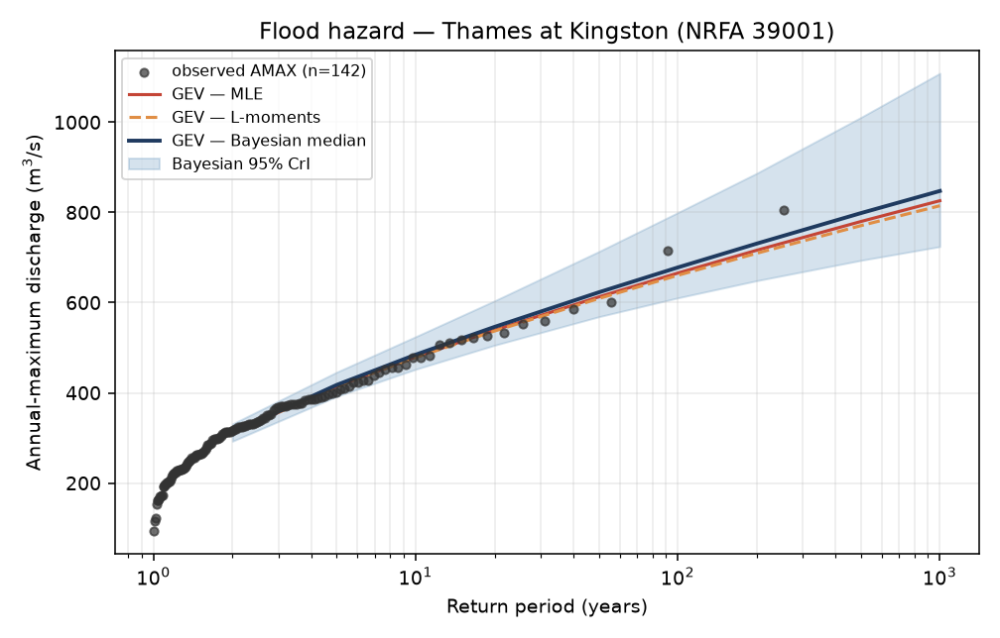
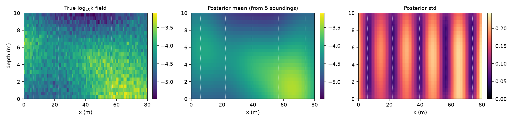
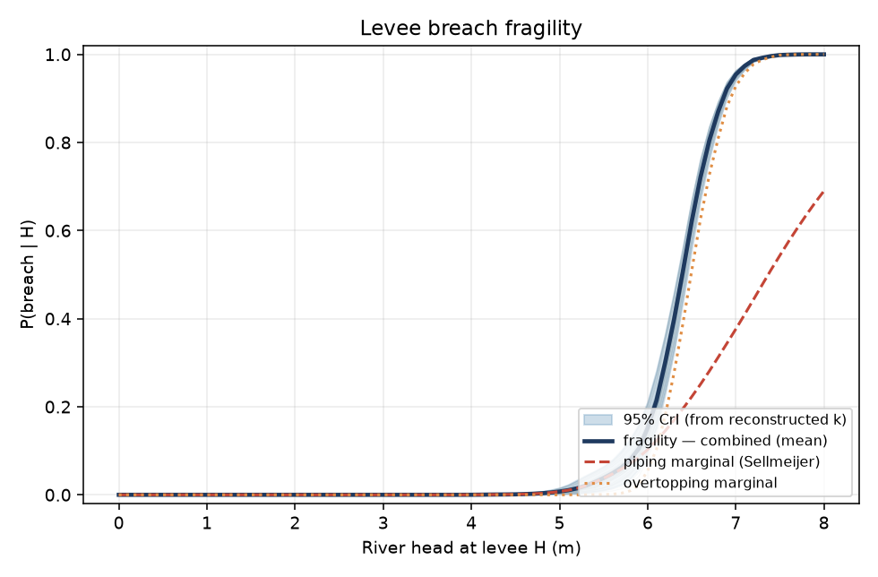
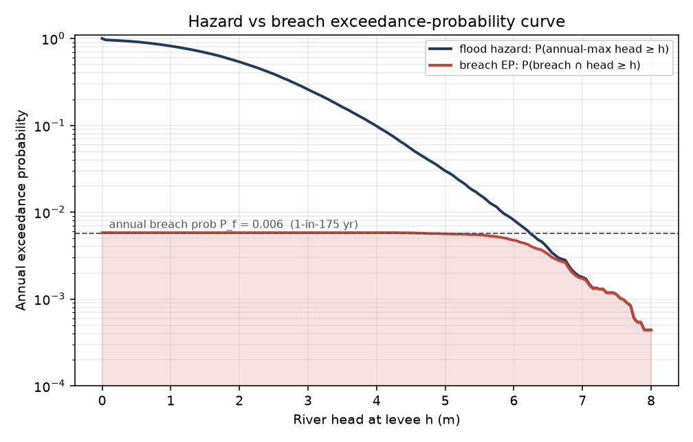

# Flood-Defence Breach Risk — a Hazard → Vulnerability → EP chain

A self-contained catastrophe-modelling demonstrator for a river levee. It walks the full
chain — **flood hazard → geotechnical breach fragility → annual breach probability and an
exceedance-probability curve** — on *real* UK flood data, and drives the vulnerability layer
with a **Bayesian posterior hydraulic-conductivity field reconstructed from sparse soundings**
(the engine from my MSc dissertation, repurposed from dam seepage to levee piping).

The point is the **intersection**: flood defences fail by *geotechnical* mechanisms
(backward-erosion piping is seepage-driven), so this is where flood hazard and ground-and-water
modelling genuinely meet.

```
 Stage 1 HAZARD            Stage 2 K-FIELD              Stage 3 FRAGILITY          Stage 4 EP
 GEV on real NRFA   →   Bayesian-Lasso recon of   →   Sellmeijer piping +   →   convolve hazard×
 annual-max flow        sparse-sounding log-k         overtopping, MC over      fragility → P_f,
 (MLE/L-mom/Bayes)      → posterior k_eff             k-posterior + lit.        catalogue, EP curve
```

## Headline result

> **Idealised Thames-at-Kingston levee, one synthetic foundation realization: annual breach
> probability P_f ≈ 0.006, i.e. a 1-in-175-year breach (95% CrI 1-in-65 to 1-in-1041 yr).**
> Both mechanisms contribute — piping is involved in ~53% of breaches, overtopping in ~74%
> (they overlap by ~28 pp, sharing the driving head; the coherent partition piping-only /
> overtopping-only / both sums to P_f). The CrI propagates *both* the flood-hazard GEV
> posterior *and* the reconstructed-k posterior.
>
> **The absolute figure is conditional and demonstrative, not a property of real levees.**
> Across 14 synthetic foundation realizations P_f spans ~9× (1-in-26 … 1-in-238 yr, median
> ~1-in-227); the seed-2026 headline is a moderately pessimistic (~71st-pct) draw. The
> *method* — an uncertainty-propagating hazard→fragility→EP chain with a data-reconstructed
> k — is the deliverable.

| Quantity | Value |
|---|---|
| Hazard: 100-yr discharge (Bayesian median) | **678 m³/s** [610, 800] — MLE 666 / L-moments 660 |
| Hazard: GEV shape ξ (three methods) | **−0.048 / −0.056 / −0.063** (near-Gumbel, agreement) |
| Hazard NUTS diagnostics | R-hat 1.000, min ESS 4088, 16/8000 divergences |
| k-field: effective seepage-path k (series/parallel) | **7.3×10⁻⁵ m/s** [5.9, 8.3]×10⁻⁵ (true 7.5×10⁻⁵) |
| k-field: reconstruction from 5 soundings | RMSE 0.18 log₁₀-units |
| Fragility: half-breach head | **6.39 m**; P(breach \| 100-yr head) = 0.06 |
| **Breach: annual probability P_f (seed 2026)** | **0.0057 → 1-in-175 yr** (CrI 1-in-65 … 1-in-1041) |
| Breach: across 14 foundation realizations | 1-in-26 … 1-in-238 yr (~9× spread), median ~1-in-227 |
| Breach: mechanism partition (sums to P_f) | **piping-only 0.0015 / overtopping-only 0.0027 / both 0.0016** → piping ~53%, overtopping ~74% |






## The four stages

**1 — Flood hazard (`hazard_gev.py`).** GEV fit to 142 annual-maximum discharges (Thames at
Kingston, NRFA 39001, 1883–2024) three independent ways — MLE, L-moments (Hosking), and
Bayesian NUTS (numpyro). Agreement across estimators is evidence the tail is data-constrained.
Discharge is mapped to river head at the levee via a transparent idealised rating
`H = max(0, C·Q^0.6 − Z0)` (wide-channel Manning exponent; constants calibrated, not surveyed).
The Bayesian posterior is carried forward as a posterior-predictive catalogue of annual-maximum head.

**2 — k-field (`kfield.py`) — the signature move.** The foundation aquifer's spatially variable
log₁₀(k) field is reconstructed from **5 sparse vertical CPT-like soundings** by Bayesian
compressed sensing: a Gaussian RBF dictionary + a Park & Casella (2008) Bayesian-Lasso Gibbs
sampler (a slim, self-contained re-implementation of my dissertation engine). The output is the
**posterior of the effective seepage-path conductivity k_eff**, reduced from the 2D field by the
*series/parallel* rule appropriate to along-path Darcy flow (depth-arithmetic-mean per column,
then harmonic-mean along the flow direction) — **not** a geometric mean (that is the heuristic for
areal 2D flow and biases k_eff high here). This is data-driven soil information, not a textbook
lognormal. (The pointwise field CrI coverage is ~0.79, slightly over-confident — the same "denser
arrays over-confident" behaviour I documented in the dissertation; the aggregate k_eff is
well-calibrated, the truth inside its 95% interval. Caveat in Limitations: collapsing the field to
a scalar mean understates that piping *initiates* at the most-permeable local path.)

**3 — Fragility (`fragility.py`).** Sellmeijer (2011) backward-erosion piping critical head
`Hc = L·F_R·F_S·F_G`, with k drawn from the Stage-2 posterior and d70, aquifer thickness,
seepage length and a model-uncertainty factor from lognormal literature distributions; plus an
overtopping mechanism (uncertain crest). Series system (breach if either). One fragility curve
per k-posterior draw, so the curve's spread *is* the propagated sparse-data k uncertainty.

**4 — Breach EP (`breach_ep.py`).** Convolve hazard × fragility:
`P_f = E_H[ P(breach | H) ]`. The 95% credible interval pairs GEV-posterior draws with
k-fragility curves. A 50,000-year synthetic catalogue and a breach exceedance-probability curve
(hazard head-exceedance vs P(breach ∩ head ≥ h)) complete the chain.

## Data-driven vs literature-driven (stated, not hidden)

- **Data-driven:** the flood hazard — real NRFA annual-maximum discharge, longest available record.
- **Literature-driven:** the idealised levee geometry and the soil/geometry parameter
  distributions (Sellmeijer constants; d70, D, L, model factor, crest), from the levee-piping
  reliability literature. The *k* distribution is replaced by my own Bayesian reconstruction.
- **Idealised:** a single levee cross-section. This is a **methodological demonstrator**, not a
  real-asset assessment of any specific Thames levee.

## Reproduce

```bash
uv sync
uv run python download.py      # NRFA AMAX (station 39001; pass another id to change)
uv run python hazard_gev.py    # Stage 1  -> outputs/hazard.npz, figures/
uv run python kfield.py        # Stage 2  -> outputs/kfield.npz, figures/
uv run python fragility.py     # Stage 3  -> outputs/fragility.npz, figures/
uv run python breach_ep.py     # Stage 4  -> outputs/breach_ep.npz, figures/
```
JAX is pinned to CPU for bit-identical NUTS on any machine; all seeds are fixed.

## Limitations

- **Conditional on one synthetic foundation realization.** P_f flows from a single random "true"
  k-field (seed 2026). Across 14 realizations it spans ~9× (1-in-26 … 1-in-238 yr, median ~1-in-227);
  the headline seed is moderately pessimistic (~71st pct). A production answer would report the
  realization distribution, not a point — here the point is the *method*.
- **Scalar k_eff is a simplification of the piping limit state.** Backward-erosion piping *initiates*
  at the most-permeable connected path (a high quantile of the field); a single bulk-flow k_eff
  (even the series/parallel one used here, which is correct for bulk flow) understates that local
  extreme. A fuller model would carry the field's spatial structure into the erosion criterion.
- **The fragility band is not k-dominated.** The reconstructed k is well-constrained, so its posterior
  is tight; the breach uncertainty is dominated by the Sellmeijer model-uncertainty factor and the
  seepage-length prior (literature lognormals). The reconstruction's value is *pinning the central k
  from data*, not contributing most of the variance — stated plainly rather than oversold.
- **The mechanism split is parameterisation-dependent.** Piping vs overtopping share moves strongly
  with seepage length / crest / realization (piping involvement ranges roughly 20–100% across
  plausible parameters), so "piping ~53%" is a property of *this* idealised levee, not of flood levees.
- Single idealised cross-section; no spatial reach of multiple levee segments, no 2D/3D FE seepage
  (the dissertation's full field solver is reused only to *produce* the k posterior, not re-solved
  per Monte-Carlo draw).
- Stationary flood frequency — no non-stationarity / climate trend in the GEV (the AMAX record
  shows the well-known recent clustering but it is not modelled here).
- The discharge→head rating and the levee geometry are calibrated illustrative values, so the
  *absolute* 1-in-175-yr figure is demonstrative; the **method** (uncertainty-propagating
  hazard→fragility→EP with a data-reconstructed k) is the deliverable.
- Piping and overtopping only; slope instability and micro-instability are out of scope.

## Development note — AI-paired build

This repository is the output of an **AI-paired build loop** (Claude Code as implementation
collaborator) under my direction.

- **Mine:** the project framing (flood × geotechnical intersection; full hazard→vulnerability→EP
  chain), the methodology (three-estimator GEV triangulation; reusing my dissertation's Bayesian
  compressed-sensing engine to supply a *data-driven* k for the fragility; Sellmeijer as the
  limit state; series-system fragility; joint hazard+k uncertainty propagation), the levee/soil
  parameterisation and calibration targets, every accept/reject decision, and the disclosure
  standard (what goes in *Limitations* and the data/literature split).
- **AI-assisted:** the Python implementation, the slim re-implementation of the Bayesian-Lasso
  sampler and RBF dictionary from my dissertation library, draft README/figure code, and
  numerical-stability patterns (Cholesky jitter, JAX Gumbel-limit branch).
- **Cross-checks I require:** every numeric claim here reconciles to a code path; the Sellmeijer
  formulation and constants are checked against the source literature; GEV diagnostics (R-hat,
  ESS, divergences) and the reconstruction's calibration (coverage, RMSE) are surfaced, not hidden.

This is the workflow I would bring to a catastrophe-modelling R&D team: AI as an accelerator on
the implementation axis, candidate judgment on methodology, scope, verification and disclosure.

## References

- Sellmeijer, J.B. et al. (2011). *Fine-tuning of the backward erosion piping model through
  small-scale, medium-scale and IJkdijk experiments.* European J. Environmental & Civil Eng.
- Schweckendiek, T. (2014). *On reducing piping uncertainties — a Bayesian decision approach.* TU Delft.
- D'Oria, M., Mignosa, P., Tanda, M.G. (2019). *Probabilistic assessment of flood hazard due to
  levee breaches using fragility functions.* Water Resources Research 55.
- Park, T. & Casella, G. (2008). *The Bayesian Lasso.* JASA 103(482).
- Coles, S. (2001). *An Introduction to Statistical Modeling of Extreme Values.* Springer.
- NRFA Peak Flow Dataset (v12), UK Centre for Ecology & Hydrology — https://nrfa.ceh.ac.uk
